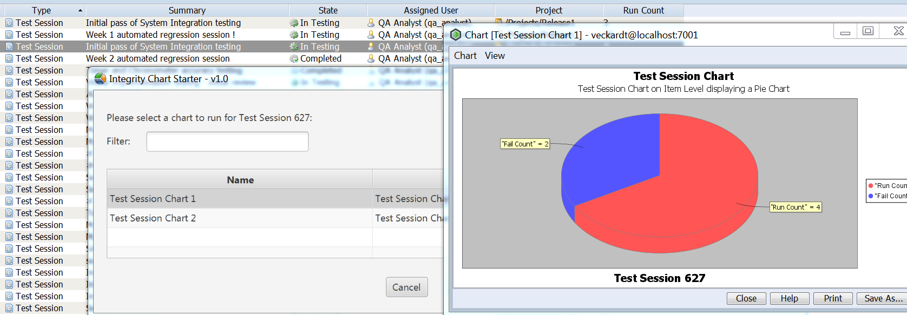

# IntegrityChartStarter
Allows you to run charts directly on item level.

## Purpose
The Chart Starter is a custom utility to execute item based charts. The idea was to allow the user to run a chart for individual items. 



## Use Cases
- As a user, I want to run a Chart for my current item, or my current document. I want to display metrics as chart.

## Install
Option 1: In IntegrityClient folder
- Put the "dist/IntegrityChartStarter.jar" directly into your IntegrityClient folder
- Copy also the files "dist/lib/IntegrityAPI.jar" and "dist/lib/jfxmessagebox-1.1.0.jar" into your IntegrityClient/lib folder
- Add a custom menu entry with:
```
name: Chart Starter
program:  ../jre/bin/javaw.exe
parameter: -jar ../IntegrityChartStarter.jar
```

Option 2: In a shared folder
- Take all files from "dist" folder and place them somewhere centrally
- Register a custom menu as described before, but with the following change
```
parameter: -jar <your shared folder>/IntegrityChartStarter.jar
```

## Configuration

Define a custom property on type level. Set the Export Configurations to the once you usually select in the Gateway. 
```
Name:  Chart.Configurations
Value: <ChartName1>,<ChartName2>,<ChartName3>
Description: (Custom) List of Charts to run for this type
```

## How to test
- open any item or document, or just stay on one in the query result
- click Custom > Chart Starter
- The custom form should open
- Start the Chart with a click at the [Run] button
- Then review the outcome

## How to debug
- check the log file in your %temp% folder: IntegrityChartStarter_2017-09-27.log

##  Development environment
- PTC Integrity LM 10.9 (also 11.0 should be fine)
- Netbeans 7.4 (or 8)
- Java 1.7 (or 1.8)

## Known Limitations
- n/a
